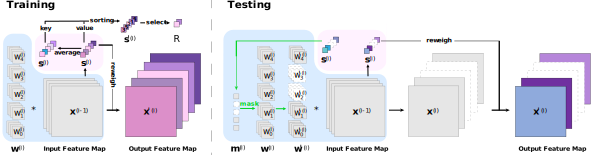

# Progressive Channel-Shrinking Network
This is the PyTorch implementation for "Progressive Channel-Shrinking (PCS) Network" 
by
[Jianhong Pan](scholar.google.com/citations?user=J_IepqIAAAAJ), 
[Siyuan Yang](scholar.google.com/citations?user=lzLsF2MAAAAJ), 
[Lin Geng Foo](scholar.google.com/citations?user=BDEOhasAAAAJ), 
[Qiuhong Ke](scholar.google.com/citations?user=84qxdhsAAAAJ), 
[Hossein Rahmani](scholar.google.com/citations?user=zFyT_gwAAAAJ),
[Zhipeng Fan](scholar.google.com/citations?user=Nb6ggPwAAAAJ), and 
[Jun Liu](scholar.google.com/citations?user=Q5Ild8UAAAAJ&hl)

### Citation

If you find our project useful in your research, please consider citing:

```
@ARTICLE{10169086,
  author={Pan, Jianhong and Yang, Siyuan and Foo, Lin Geng and Ke, Qiuhong and Rahmani, Hossein and Fan, Zhipeng and Liu, Jun},
  journal={IEEE Transactions on Multimedia}, 
  title={Progressive Channel-Shrinking Network}, 
  year={2023},
  volume={},
  number={},
  pages={1-11},
  doi={10.1109/TMM.2023.3291197}}
```

## Introduction

Progressive Channel-Shrinking (PCS) can compress the selected salience entries at run-time instead of roughly approximating them to zero. Running Shrinking Policy provides a testing-static pruning scheme that can reduce the memory access cost for filter indexing. The evaluation of our method on ImageNet and CIFAR10 datasets over two prevalent networks: ResNet and VGG demonstrates that our PCS outperforms all baselines and achieves state-of-the-art in terms of compression- performance tradeoff. Moreover, it can be observed a significant and practical acceleration of inference. 

<div align=center>
<br>
Figure 1: Overview of a PCS layer.
</div>
